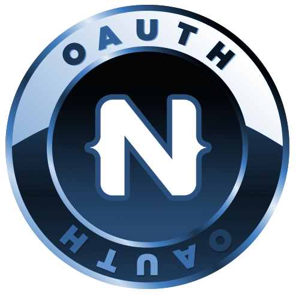

# OAuth 2 login plugin for NativeScript

Library for interacting with OAuth 2.0 in NativeScript applications that provides simplified client access with a OAuth providers that support the OAuth 2.0 protocol such as Microsoft Live accounts, Microsoft Graph, Office 365, Facebook, and Google (Google is a work in progress due to some of their restrictions).

***NEW:*** **Now with Android Support!**

<br/>

Tested against Microsoft Live, Office 365, Microsoft Graph API, and Facebook.

## Prerequisites

### Office 365 / Microsoft Graph API
For logging in with your Office 365 account, you should have an Office 365 Account admin account. If you don't have one yet, you can get a [free trial here](https://products.office.com/en-us/try).

Watch a [video tutorial](https://youtu.be/nwf928oFGCM) for setting up the NativeScript OAuth plugin and registering you app with Microsoft.


Register your mobile app [here](https://apps.dev.microsoft.com). This will require you to login with your Office 365 account. You can then click the big "Add an app" button and go through the steps listed there, starting with giving you app a name. On the app creation screen, you need to do 3 things:

1. Click the "Add Platform" button and select "Mobile application"
2. Copy the "Client Id" GUID from the Mobile Application section.
3. Click "Save" at the bottom. 

### Facebook account
For logging in with your Facebook account, you should have a Facebook developer account. If you don't have one yet, you can get one [here](https://developers.facebook.com/).

Register your mobile app by following the wizard under "My Apps" -> "Add a new app".

1. Go to https://developers.facebook.com/apps and create a new app
2. If you see the Product Setup page, select Facebook login
3. Under the Client OAuth section, enter ```https://www.facebook.com/connect/login_success.html``` as your Valid OAuth redirect URIs
4. Click Save
5. Copy the App ID and the App Secret from the Dashboard page to bootstrap your app. These will be the ClientID and CLientSecret respectively.


## Setup

Add TypeScript to your NativeScript project if you don't already have it added. While this is not a requirement, it's highly recommended. If you want to watch a video on how to convert your existing JavaScript based NativeScript app to TypeScript, [watch it here](https://youtu.be/2JDXnduTlgs).

From the command prompt go to your app's root folder and execute:

```
tns plugin add nativescript-oauth
```


## Usage

If you want a quickstart, [get the demo app here](https://github.com/alexziskind1/nativescript-oauth/tree/master/demo).

### Bootstrapping
We need to do some wiring when your app starts, so open `app.ts` and add this before `application.start();`:

##### TypeScript
```js
import * as tnsOAuthModule from 'nativescript-oauth';
```

###### For Office365 login, include the following lines

```js
var o365InitOptions : tnsOAuthModule.TnsOAuthOptionsOffice365 = {
    clientId: 'e392f6aa-da5c-434d-a42d-a0e0a27d3955', //client id for application (GUID)
    scope: ['Files.ReadWrite', 'offline_access'] //whatever other scopes you need
};

tnsOAuthModule.initOffice365(o365InitOptions);
```


###### For Facebook login, include the following lines

```js
var facebookInitOptions : tnsOAuthModule.TnsOAuthOptionsFacebook = {
    clientId: '1119818654921555',
    clientSecret: 'bbb58f212b51e4d555bed857171c9aaa',
    scope: ['email'] //whatever other scopes you need
};

tnsOAuthModule.initFacebook(facebookInitOptions);
```

### Logging in

In your view controller (or wherever you will have a handler to respond to the login user action) you will reference the ```nativescript-oauth``` module again and call the ```login``` function.

```js
import * as tnsOAuthModule from 'nativescript-oauth';
...
tnsOAuthModule.login()
    .then(()=>{
        console.log('logged in');
        console.dir("accessToken " + tnsOAuthModule.accessToken());
    })
    .catch((er)=>{
        //do something with the error
    });
```

When you make API calls you can use the ```ensureValidToken``` function, which will also ask you to authenticate, if the token is expired. 

```js
tnsOAuthModule.ensureValidToken()
    .then((token: string)=>{
        console.log('token: ' + token);
    })
    .catch((er)=>{
        //do something with the error
    });
```


## Contributing

1. Fork the nativescript-oauth repository on GitHub
2. Clone your fork
3. Change directory to ```nativescript-oauth```
4. Run ```npm install``` to install all npm packages for the plugin
5. Change directory to ```demo```
6. Run ```npm install``` to install all npm packages for the demo project
7. Replace the ClientId in the app.ts file of the demo with your own ClientId
8. Run the demo project
